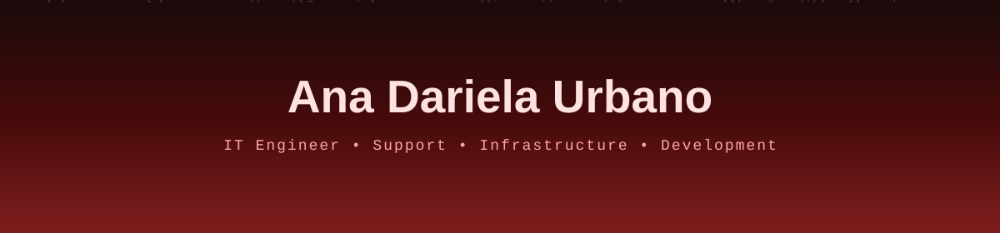

<!-- ═══════════════════════════════════════════════════════════════ -->
<!-- 🔥 BANNER SVG (fondo animado con lluvia de código) -->

<!-- ⌨️ Typing SVG Multilínea (animado, estable) -->

  

<!-- 🏷️ Badges decorativos -->

  

<!-- 🧭 Navegación con badges -->

 

<!-- ═══════════════════════════════════════════════════════════════ -->

<!-- ═══════════════════════════════════════════════════════════════ -->
<h2 align="center">
  
  About Me
</h2>

**⚡ Ana Dariela Urbano**

`💼 IT Engineer`

`🎯 Support • Infrastructure • Development`

`📍 Coahuila, México`

 

> *IT Engineer with hands-on experience across **technical support**, **infrastructure**, and **software development**. I spend my days solving incidents, managing networks and users, and shipping internal apps that actually make people's work easier.*

 

<!-- ═══════════════════════════════════════════════════════════════ -->
<table align="center">
<tr>
<td align="center" width="25%">
    
  <b>SUPPORT</b> 
  <code>Help Desk</code> <code>Hardware</code> <code>Software</code> <code>Troubleshooting</code>
</td>
<td align="center" width="25%">
    
  <b>INFRASTRUCTURE</b> 
  <code>VLANs</code> <code>TCP/IP</code> <code>Switches</code> <code>Routers</code>
</td>
<td align="center" width="25%">
    
  <b>DEVELOPMENT</b> 
  <code>Laravel</code> <code>React</code> <code>PHP</code> <code>REST APIs</code>
</td>
<td align="center" width="25%">
    
  <b>DATA</b> 
  <code>MySQL</code> <code>MongoDB</code> <code>SQL Server</code> <code>Queries</code>
</td>
</tr>
</table>

 

<!-- ═══════════════════════════════════════════════════════════════ -->

<!-- ═══════════════════════════════════════════════════════════════ -->
<h2 align="center">
  
   Tech Stack
</h2>

<table>
<tr>
<td align="center" width="50%">

**⚙️ Backend & Languages**

</td>
<td align="center" width="50%">

**🎨 Frontend**

</td>
</tr>
<tr>
<td align="center" width="50%">

**🗄️ Databases**

</td>
<td align="center" width="50%">

**🛠️ Tools**

</td>
</tr>
</table>

 

<!-- ═══════════════════════════════════════════════════════════════ -->

<!-- ═══════════════════════════════════════════════════════════════ -->
<h2 align="center">
  
  Support & Infrastructure
</h2>

|  **Support** |  **Networking** |  **Systems** |  **Security** |
|:---:|:---:|:---:|:---:|
| 🎧 Help Desk | 🌐 VLANs | 👥 Active Directory | 📹 CCTV |
| 💻 Hardware | 📡 TCP/IP | 🔑 Users & Permissions | 🎥 DVR / NVR |
| 🧩 Software | 🔌 Switches | 🖥️ Servers | 🔧 Installation |
| 🔍 Troubleshooting | 📶 Routers | 🪟 Windows | 🛡️ Maintenance |
| 🍃 MongoDB | 🗄️ MySQL / SQL Server | 📦 NoSQL | 🔐 Backups |

 

<!-- ═══════════════════════════════════════════════════════════════ -->

<!-- ═══════════════════════════════════════════════════════════════ -->
<h2 align="center">
  
  Featured Project
</h2>

### Ticket Management System

<i>A web / PWA platform for logging, tracking, and managing technical support incidents.</i>

  

 

<table>
<tr>
<td width="50%" valign="top">

<h4>✦ Features</h4>

- 🎫 Ticket creation & tracking
- 👤 User management
- 🔐 Authentication & access control
- 📊 Information management
- 📄 Report & file generation
- 🔌 REST API communication
- 📱 Responsive interface

</td>
<td width="50%" valign="top">

<h4>✦ Architecture</h4>

| Layer | Tech |
|:---|:---|
| 🎨 **Frontend** | React + Vite |
| ⚙️ **Backend** | Laravel + PHP |
| 🗄️ **Database** | MySQL |
| 🍃 **NoSQL** | MongoDB |
| 🔌 **API** | REST |
| 🌿 **Versioning** | Git / GitHub |

</td>
</tr>
</table>

 

<!-- ═══════════════════════════════════════════════════════════════ -->

<!-- ═══════════════════════════════════════════════════════════════ -->
<h2 align="center">
  
   GitHub Stats
</h2>

  

  

 

<!-- ═══════════════════════════════════════════════════════════════ -->

<!-- ═══════════════════════════════════════════════════════════════ -->
<h2 align="center">
  
  ✉ Contact
</h2>

  

<!-- ⌨️ Typing final -->

 

<!-- ═══════════════════════════════════════════════════════════════ -->
<!-- 🔥 FOOTER SVG (fondo animado con lluvia de código) -->

